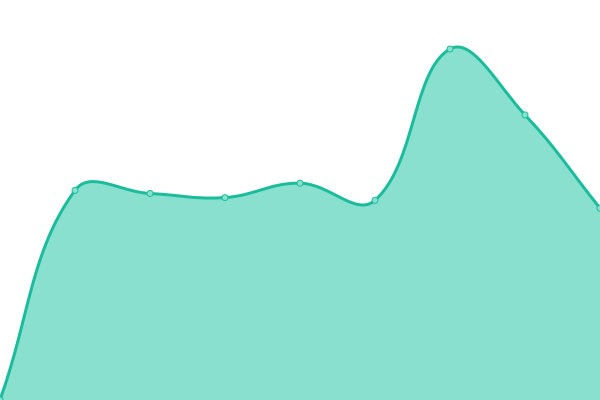

# [📈 Live Status](https://upptime.github.io/upptime): <!--live status--> **🟩 All systems operational**

This repository contains the open-source uptime monitor and status page for [Upptime](https://upptime.js.org), powered by [Upptime](https://github.com/upptime/upptime).

With [Upptime](https://upptime.js.org), you can get your own unlimited and free uptime monitor and status page, powered entirely by a GitHub repository. We use [Issues](https://github.com/upptime/upptime/issues) as incident reports, [Actions](https://github.com/orviz/dtgeo/actions) as uptime monitors, and [Pages](https://upptime.github.io/upptime) for the status page.

<!--start: status pages-->
<!-- This summary is generated by Upptime (https://github.com/upptime/upptime) -->
<!-- Do not edit this manually, your changes will be overwritten -->
<!-- prettier-ignore -->
| URL | Status | History | Response Time | Uptime |
| --- | ------ | ------- | ------------- | ------ |
|  [DT-GEO metadata catalog prototype API](https://ics-c.epos-ip.org/development/k8s-epos-deploy/dt-geo/api/v1) | 🟩 Up | [dt-geo-metadata-catalog-prototype-api.yml](https://github.com/orviz/dtgeo/commits/HEAD/history/dt-geo-metadata-catalog-prototype-api.yml) | 

 1145ms
     
 | 

<a href="https://orviz.github.io/dtgeo/history/dt-geo-metadata-catalog-prototype-api">27.99%</a>
    

|  [DT-GEO metadata catalog WEB](https://ics-c.epos-ip.org/development/k8s-epos-deploy/dt-geo/) | 🟩 Up | [dt-geo-metadata-catalog-web.yml](https://github.com/orviz/dtgeo/commits/HEAD/history/dt-geo-metadata-catalog-web.yml) | 

 201ms
     
 | 

<a href="https://orviz.github.io/dtgeo/history/dt-geo-metadata-catalog-web">98.12%</a>
    

|  [EPOS Data Portal API](https://www.ics-c.epos-eu.org/api/v1/) | 🟩 Up | [epos-data-portal-api.yml](https://github.com/orviz/dtgeo/commits/HEAD/history/epos-data-portal-api.yml) | 

 2131ms
     
 | 

<a href="https://orviz.github.io/dtgeo/history/epos-data-portal-api">100.00%</a>
    

|  [EPOS Data Portal API for RO-Crate](https://ics-c.epos-ip.org/rocrateservice/eposgeojson) | 🟩 Up | [epos-data-portal-api-for-ro-crate.yml](https://github.com/orviz/dtgeo/commits/HEAD/history/epos-data-portal-api-for-ro-crate.yml) | 

 126ms
     
 | 

<a href="https://orviz.github.io/dtgeo/history/epos-data-portal-api-for-ro-crate">100.00%</a>
    

<!--end: status pages-->

[**Visit our status website →**](https://upptime.github.io/upptime)

## 📄 License

- Powered by: [Upptime](https://github.com/upptime/upptime)
- Code: [MIT](./LICENSE) © [Anand Chowdhary](https://anandchowdhary.com), supported by [Pabio](https://pabio.com)
- Data in the `./history` directory: [Open Database License](https://opendatacommons.org/licenses/odbl/1-0/)
